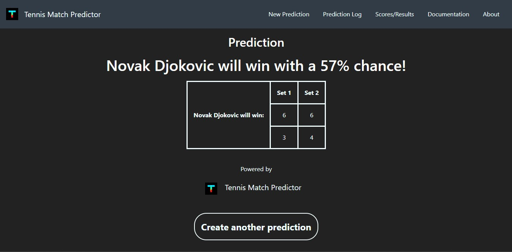
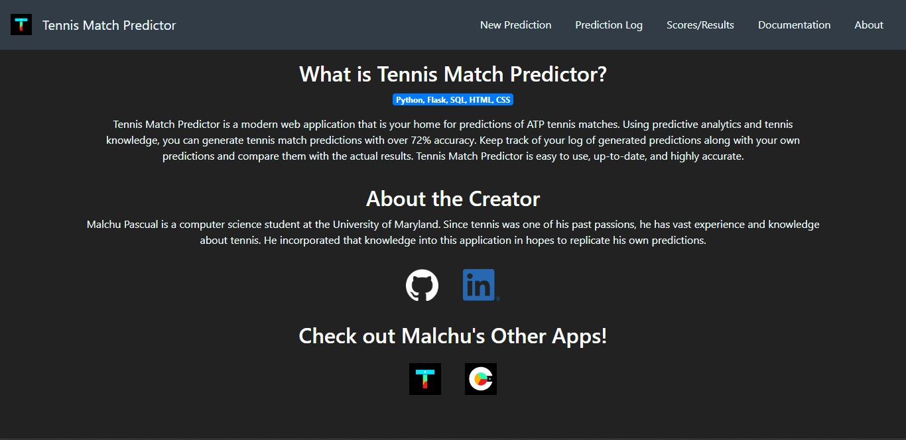
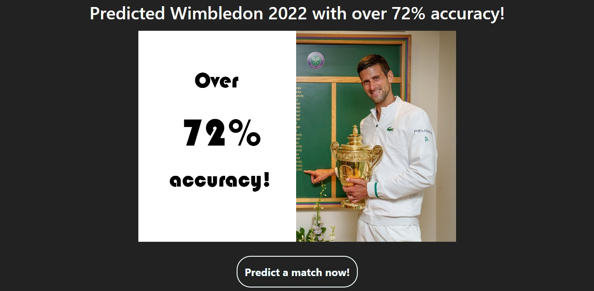
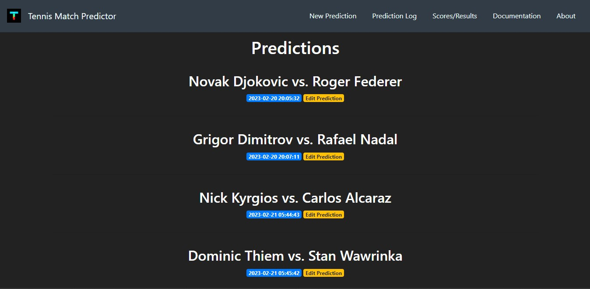

# Tennis Match Predictor
*Author: [Malchu Pascual](https://github.com/malchu)* 
*Link: [Tennis Match Predictor](https://tennismatchpredictor.malchupascual.repl.co/)*
## Introduction
Tennis is a sophisticated sport. It can often be extremely difficult to predict who will win a tennis match due to many deciding factors, such as form, rank, head-to-head, and win-loss record. This program accounts for many of those factors to solve this problem by being able to predict who will win in an ATP tennis match between 2 men's professional players. Given 2 names of ATP players as input for a tennis match between them, a winner is predicted along with percent probabilities of how likely each player could win that match.

